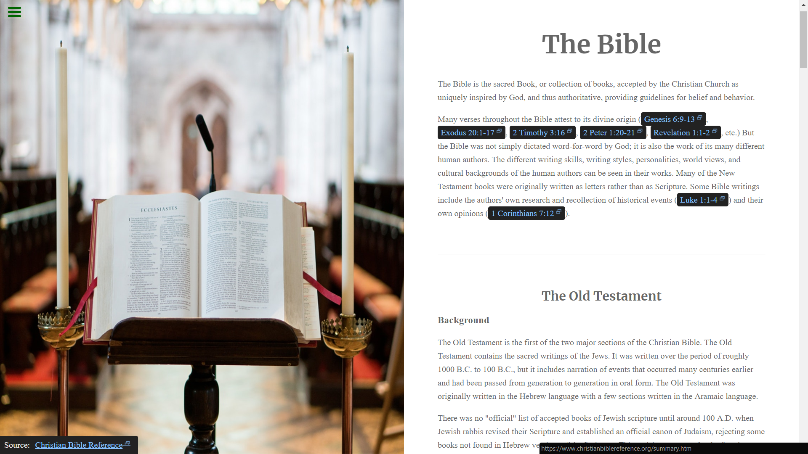

# The Bible | Tribute Page

The Bible tribute page is a freeCodeCamp's Responsive Web Design Track Project, where it shows some of the very important information like doctrines in the bible.

## Built With

- HTML5
- CSS3

Visit the [live preview](https://genesisgabiola.github.io/the-bible/).  
Check the project in [CodePen](https://codepen.io/genesisgabiola/full/BqXZaW/).

## Future Improvements

- [ ] Maybe change the background image to a more elegant image.
- [ ] Make the page more responsive for the smaller devices.
- [ ] Display a verse tooltip when hover to a passage verse link.

## Contributing

Choose what you prefer:

- Open an [issue](https://github.com/genesisgabiola/the-bible/issues).
- Contact me on [twitter](http://twitter.com/genesisgabiola).

Any queries, suggestions, issues to report or critics are welcome :) You can freely connect to me.

## Acknowledgement

- [freeCodeCamp](https://www.freecodecamp.org/)
- [Pexels](https://www.pexels.com/)
